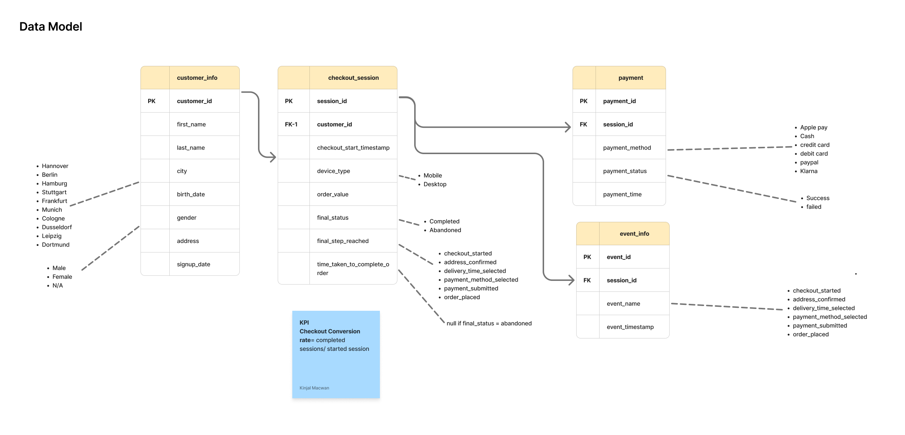

# 🛵 lieferando-checkout-conversion-analysis

**Product / Data Analytics — Funnel Analysis**  
*A case study using synthetic Lieferando order data*

---

## 📌 Context

Lieferando connects customers with restaurants — discover food, order it, and get it delivered.

The ordering journey has multiple steps between opening the app and getting a meal: browsing restaurants, picking food, building a cart, checking out, paying, and finally placing the order.

Every one of those steps is a potential point of drop-off.

**Checkout is the focus of this analysis.**

By the time a user starts checkout, they have already decided to order. Losing them at this stage is less about restaurant discovery or menu selection and more about friction in the checkout process.

That makes checkout drop-off both **costly and potentially solvable**.

---

## 🎯 Goal

**Improve checkout conversion:** the share of people who actually complete an order once they've started checkout.

> More completed orders → more transactions → more revenue.

This is the main business outcome that the analysis ties back to.

---

## 🔎 The Problem

The largest leak currently identified is:

**Payment Method Selected → Payment Submitted**

This step loses **16.78% of users** that's nearly double the drop-off at any other step in checkout.


What makes the payment step interesting is that people are already past the point of casual browsing — they've confirmed an address and picked a delivery time. That's real intent. Something at payment is still knocking a big chunk of them out anyway.

---

### 🔽 Checkout Funnel
```text
Checkout Started → Address Confirmed → Delivery Time Selected
→ Payment Method Selected → Payment Submitted → Order Placed
```

---

## 🗂️ Data

Three tables tie the funnel together: `customer_info`, `checkout_session`, and `payment`, plus `event_info` for step-level event logging.

- `customer_info` → `checkout_session` on `customer_id`
- `checkout_session` → `payment` and `event_info` on `session_id`

`checkout_session` carries the key funnel fields — `final_status` (completed / abandoned), `final_step_reached`, `device_type`, `order_value`, and `time_taken_to_complete_order` (null when abandoned). `payment` holds method and status (success / failed). `event_info` logs each funnel step as its own timestamped event, which is what makes step-by-step conversion and drop-off calculable in the first place.

> **Checkout Conversion Rate = completed sessions / started sessions**
## 🗂️ Data Model


## 🛠️ Tools

Excel · SQL · Tableau

## 🔍 Approach

I didn't want to stop at "here's where people drop off" — that's descriptive, not useful. So the analysis is built around four questions, in order:

| # | Question |
|---|---|
| 1️⃣ | **Where** is the biggest leak, and how big is it relative to every other step? |
| 2️⃣ | **Who** is dropping off — which segments abandon at a higher rate? |
| 3️⃣ | **Why** — what's actually driving it (payment failures, device, delivery cost, order value)? |
| 4️⃣ | **What's it worth** — if the leak at that step shrinks, what's the revenue recovered? |

Step-level conversion and drop-off rates were calculated across the full funnel rather than treating "checkout abandonment" as one lump number — the whole point was to find the one step doing most of the damage instead of guessing.

## 🌟 About Me & Connect

Hi! I'm **Kinjal Macwan**, a passionate professional working on building robust data analytics and engineering solutions. I enjoy modeling datasets, crafting efficient SQL transformations, and turning raw data into business intelligence.

Feel free to connect or reach out for collaboration!

[](https://www.linkedin.com/in/kinjal-macwan-90560a215)
[](https://github.com/Macwankinjal18)
[](mailto:macwankinjal500@gmail.com)


